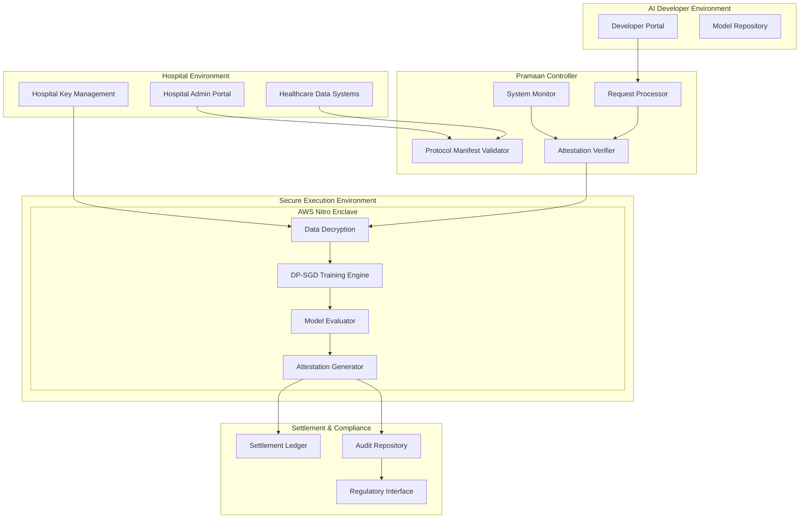

# Design Document: Pramaan-Health

## Overview

Pramaan-Health implements a confidential AI training protocol that enables hospitals to contribute sensitive healthcare data for AI model training without exposing raw patient information. The system provides cryptographically verifiable trust through hardware-isolated execution, differential privacy enforcement, symmetric confidentiality protection (for both hospital data and developer IP), and comprehensive attestation mechanisms.

The architecture follows a four-layer design: Policy Layer (The Handshake), Execution Layer (The Vault), Incentive Layer (The Settlement), and Trust & Compliance Layer (The Proof). Each layer provides specific guarantees while maintaining end-to-end security and regulatory compliance.

**Core Governance Principles:**
- **Social Credits** are non-monetary, non-transferable, auditable units of verified impact representing institutional contribution (not individual patient tracking)
- **Deterministic Credit Minting** based on normalized improvement scores with protocol-defined caps to prevent gaming
- **Standardized Redemption** through capped, time-bound API/inference credits for public-sector usage (no negotiations, no IP conflicts)
- **Template-Driven Manifests** with structural constraints (not AI-generated free-form contracts)
- **Symmetric Confidentiality** protecting both hospital data and developer IP through enclave isolation
- **Institutional Verification** via DigiLocker document validation (not Aadhaar-based)

## Architecture

The Pramaan-Health system employs a distributed architecture with secure enclaves as the core trust boundary:



## Components and Interfaces

### Policy Layer Components

**Protocol Manifest Validator**
- Validates machine-readable policy documents against template-defined schemas
- Enforces purpose limitation, dataset scope, and privacy constraints
- Supports versioning with immutability guarantees after job start
- Validates manifest hash to prevent retroactive edits
- Interface: REST API for manifest CRUD operations

**Manifest Template Manager**
- Provides healthcare-specific templates: diagnostic classification (public health), diagnostic classification (research), segmentation, risk scoring
- Predefines allowed metrics, normalization methods, credit mapping, caps, and redemption mechanics
- Prevents AI-generated free-form contracts through structural constraints
- Interface: Template selection and instantiation API

**Request Processor**
- Processes AI developer training requests with binary acceptance model
- Validates requests against approved Protocol Manifests
- Manages request lifecycle and status tracking
- Enforces no post-hoc negotiation policy
- Interface: GraphQL API for request submission and tracking

**DigiLocker Verification Service**
- Verifies hospital institutional authority via document validation
- Validates registration certificates, government affiliation documents, authorization letters
- Checks issuer authenticity and document validity
- Does NOT store Aadhaar numbers or process biometric data
- Interface: DigiLocker API integration for institutional verification

### Execution Layer Components

**Secure Enclave Manager**
- Manages AWS Nitro Enclave lifecycle
- Handles enclave attestation and integrity verification
- Controls data ingress/egress policies with network isolation
- Validates Enclave Image File (.eif) hash without inspecting internals
- Interface: Internal service with hardware attestation APIs

**Data Decryption Service**
- Decrypts healthcare data within enclave memory only
- Implements zero-persistence data handling
- Manages hospital encryption keys securely via AWS KMS
- Interface: Internal enclave service with key management integration

**DP-SGD Training Engine**
- Implements differentially private stochastic gradient descent
- Tracks privacy budget consumption (epsilon, delta parameters)
- Enforces training termination on budget exhaustion
- Executes developer-submitted .eif code without external inspection
- Interface: Internal training API with privacy accounting

**Model Evaluator**
- Evaluates trained models against success metrics within trusted boundary
- Computes baseline metrics and new model metrics inside enclave
- Calculates Normalized Improvement Score (NIS) using protocol-defined formula
- Prevents metric manipulation by external parties
- Interface: Internal evaluation service with metric computation APIs

**Symmetric Confidentiality Enforcer**
- Ensures hospital data never leaves enclave in raw form
- Ensures developer IP (code, weights, evaluation logic) never leaves enclave
- Allows only aggregated outputs: verified metrics, NIS, credits, signed receipts
- Prevents persistence of proprietary artifacts outside enclave
- Interface: Internal enclave boundary control

### Incentive Layer Components

**Normalized Improvement Score (NIS) Calculator**
- Computes NIS using formula: NIS = (NewMetric - BaselineMetric) / (1 - BaselineMetric)
- Accounts for diminishing returns at high baseline performance
- Ensures consistent improvement quantification across different baseline levels
- Interface: Internal calculation service

**Credit Minting Engine**
- Mints Social Credits deterministically based on protocol-defined credit bands
- Maps NIS ranges to specific credit amounts (no hospital discretion)
- Enforces hard caps: max credits per run (e.g., 500 SC), max per hospital per model per year (e.g., 5,000 SC)
- Prevents credit inflation through protocol-level constraints
- Allocates credits to institutional recipients (Hospital/Data Fiduciary), not individuals
- Interface: Internal service with settlement integration

**Settlement Ledger**
- Records credit transactions on permissioned blockchain (Amazon Managed Blockchain - Hyperledger Fabric)
- Maintains immutable transaction history with institutional recipients
- Does NOT track individual patient-level credit allocation
- Interface: Blockchain RPC with smart contract integration

**Redemption Manager**
- Manages standardized Model Access redemption: capped, time-bound API/inference credits
- Enforces public-sector usage restrictions
- Prevents lifetime free access or unlimited licensing
- Supports optional institutional allocation records without monetary transfer
- Interface: Redemption API with usage tracking

### Trust & Compliance Layer Components

**Attestation Generator**
- Creates cryptographically signed attestation receipts with hardware-backed keys
- Includes proofs of policy enforcement and privacy compliance
- Generates merkle proofs of execution integrity
- Embeds compliance statements in receipts
- References manifest hash to prevent retroactive edits
- Interface: Internal service with hardware signing keys

**Visibility Control Manager**
- Enforces role-based visibility: Hospital sees credits + receipts, Developer sees own job outcomes, Regulator sees audit trails (if granted), Public sees aggregate stats only
- Prevents exposure of credits as public social media-style metrics
- Ensures no dataset or patient identifiers in public data
- Interface: Access control API with role-based permissions

**Audit Repository**
- Stores compliance artifacts and audit trails
- Provides tamper-evident logging capabilities
- Supports regulatory reporting requirements
- Maintains immutable logs for forensic analysis
- Interface: REST API for audit data retrieval

**Regulatory Interface**
- Provides standardized compliance reporting
- Enables third-party attestation verification
- Supports DPDP Act reporting requirements
- Delivers judge-proof compliance statements
- Interface: REST API with regulatory data formats

## Data Models

### Protocol Manifest Schema

```json
{
  "manifestId": "string (UUID)",
  "version": "string (semver)",
  "manifestHash": "string (SHA-256 hash for immutability)",
  "templateType": "enum (diagnostic-classification-public-health, diagnostic-classification-research, segmentation, risk-scoring)",
  "hospital": {
    "id": "string",
    "name": "string",
    "publicKey": "string (PEM)",
    "digiLockerVerification": {
      "registrationCertificate": "string (document ID)",
      "governmentAffiliation": "string (document ID)",
      "authorizationLetter": "string (document ID)",
      "verificationStatus": "enum (verified, pending, failed)",
      "verificationTimestamp": "timestamp"
    }
  },
  "purposeLimitation": {
    "allowedPurposes": ["string"],
    "prohibitedUses": ["string"],
    "dataRetentionPeriod": "duration"
  },
  "datasetScope": {
    "dataTypes": ["string"],
    "patientCriteria": "object",
    "temporalRange": {
      "startDate": "date",
      "endDate": "date"
    },
    "sampleSize": "integer"
  },
  "privacyGuardrails": {
    "epsilonBudget": "number",
    "deltaBudget": "number",
    "minimumGroupSize": "integer",
    "suppressionThreshold": "integer"
  },
  "successMetrics": {
    "primaryMetric": "string",
    "baselineMetric": "number",
    "threshold": "number",
    "evaluationMethod": "string",
    "normalizationFormula": "string (e.g., NIS = (NewMetric - BaselineMetric) / (1 - BaselineMetric))"
  },
  "incentiveLogic": {
    "creditBands": [
      {
        "nisRange": {"min": "number", "max": "number"},
        "creditsAwarded": "integer"
      }
    ],
    "maxCreditsPerRun": "integer (e.g., 500)",
    "maxCreditsPerHospitalPerModelPerYear": "integer (e.g., 5000)",
    "institutionalRecipient": "string (Hospital/Data Fiduciary ID)"
  },
  "redemptionMechanics": {
    "modelAccessRequired": "boolean",
    "modelAccessTerms": {
      "type": "enum (api-inference-credits)",
      "cappedCredits": "integer",
      "timeBound": "duration",
      "usageRestriction": "enum (public-sector-only)"
    },
    "optionalInstitutionalAllocation": "string (program-level public health fund)"
  },
  "developerAcceptance": {
    "acceptanceRequired": "boolean",
    "acceptanceType": "enum (binary-accept-decline)",
    "noNegotiation": "boolean (true)"
  },
  "signature": "string (cryptographic signature)",
  "createdAt": "timestamp",
  "immutableAfterJobStart": "boolean (true)"
}
```

### Training Request Schema

```json
{
  "requestId": "string (UUID)",
  "manifestId": "string (UUID)",
  "manifestVersion": "string (semver)",
  "manifestHash": "string (SHA-256 for verification)",
  "aiDeveloper": {
    "id": "string",
    "name": "string",
    "publicKey": "string (PEM)",
    "manifestAcceptance": {
      "accepted": "boolean",
      "acceptanceTimestamp": "timestamp",
      "acceptanceSignature": "string (cryptographic signature)"
    }
  },
  "enclaveImageFile": {
    "eifHash": "string (SHA-256 hash)",
    "eifSize": "integer (bytes)",
    "eifUploadTimestamp": "timestamp",
    "containsProprietaryCode": "boolean (true - not inspected by controller)"
  },
  "modelSpecification": {
    "architecture": "string",
    "hyperparameters": "object",
    "trainingConfig": "object"
  },
  "computeRequirements": {
    "instanceType": "string",
    "maxTrainingTime": "duration",
    "memoryRequirements": "string"
  },
  "status": "enum (pending, approved, rejected, executing, completed)",
  "submissionTimestamp": "timestamp",
  "signature": "string (cryptographic signature)"
}
```

### Attestation Receipt Schema

```json
{
  "receiptId": "string (UUID)",
  "requestId": "string (UUID)",
  "manifestId": "string (UUID)",
  "manifestHash": "string (SHA-256 - prevents retroactive edits)",
  "executionSummary": {
    "startTime": "timestamp",
    "endTime": "timestamp",
    "enclaveId": "string",
    "enclaveAttestation": "string (base64)",
    "eifHash": "string (SHA-256 - verified but not inspected)"
  },
  "policyEnforcement": {
    "purposeCompliance": "boolean",
    "datasetCompliance": "boolean",
    "privacyCompliance": "boolean"
  },
  "privacyAccounting": {
    "epsilonUsed": "number",
    "deltaUsed": "number",
    "privacyProof": "string (cryptographic proof)"
  },
  "dataDestruction": {
    "destructionTimestamp": "timestamp",
    "destructionProof": "string (cryptographic proof)"
  },
  "performanceResults": {
    "baselineMetric": "number",
    "newMetric": "number",
    "normalizedImprovementScore": "number (NIS)",
    "nisFormula": "string (e.g., (NewMetric - BaselineMetric) / (1 - BaselineMetric))",
    "creditsAwarded": "integer",
    "creditBandApplied": "string",
    "institutionalRecipient": "string (Hospital/Data Fiduciary ID)",
    "noIndividualPatientTracking": "boolean (true)"
  },
  "redemptionDetails": {
    "modelAccessGranted": "boolean",
    "apiInferenceCredits": "integer",
    "timeBound": "duration",
    "usageRestriction": "string (public-sector-only)",
    "noLifetimeFreeAccess": "boolean (true)",
    "noCashOut": "boolean (true)"
  },
  "cryptographicProofs": {
    "executionIntegrity": "string (merkle proof)",
    "outputConstraints": "string (proof)",
    "chainOfCustody": "string (proof)",
    "symmetricConfidentiality": "string (proof - both hospital data and developer IP protected)"
  },
  "visibilityControl": {
    "hospitalVisible": "boolean (true)",
    "developerVisible": "boolean (true - own job only)",
    "regulatorVisible": "boolean (if granted)",
    "publicVisible": "boolean (aggregate stats only, no identifiers)"
  },
  "signature": "string (hardware-backed signature)",
  "timestamp": "timestamp",
  "complianceStatements": [
    "Credits are not money and cannot be cashed out",
    "No individual patient tracking for credit allocation",
    "Model access is standardized as capped API/inference credits",
    "Developers accept manifest or decline; no post-hoc negotiation",
    "Institutional verification is document-based via DigiLocker; Pramaan does not access Aadhaar data"
  ]
}
```

## Social Credit Governance Model

### What Social Credits Are

Social Credits (SC) are **non-monetary, non-transferable, auditable units of verified impact** that represent institutional contribution to measurable model performance improvement.

**Key Characteristics:**
- NOT cash, NOT cryptocurrency for speculation, NOT tradable
- NOT held by individuals or tracked at patient level
- Protocol-level accounting units representing "verified contribution" of a data fiduciary's dataset
- Benefit institutions and public-interest entities, not individuals

### Credit Minting Logic (Anti-Gaming)

**Core Principle:** Credits are minted ONLY based on verified outcome improvement, not based on data quantity, age, or claimed quality directly.

**Deterministic Minting Process:**
1. Baseline metrics computed inside enclave
2. Trained model metrics computed inside enclave
3. Normalized Improvement Score (NIS) calculated: `NIS = (NewMetric - BaselineMetric) / (1 - BaselineMetric)`
4. NIS mapped to credits via protocol-defined credit bands
5. Hard caps enforced automatically

**Why Normalization Matters:**
Raw metric deltas can be misleading (0.02 improvement from 0.50 baseline vs. 0.98 baseline have very different significance). NIS normalization ensures:
- Same delta "worth more" when baseline is low
- Same delta "worth less" when baseline is already high
- Consistent valuation across different performance regimes

**Protocol-Defined Constraints:**
- Credit bands map NIS ranges to SC amounts (hospitals cannot arbitrarily assign)
- Max credits per training run (e.g., 500 SC)
- Max credits per hospital per model per year (e.g., 5,000 SC)
- Hospitals choose a template, not the numeric credit table

### Credit Visibility Model

**Hospital/Data Fiduciary:** Full visibility to credits earned and attestation receipts

**AI Developer:** Sees credit impact outcome only for their own training jobs

**Regulator/Auditor:** Read-only access to receipts and audit trails (when granted)

**Public:** Optional aggregate statistics only (no dataset or patient identifiers)

**NOT Public Metrics:** Credits are NOT exposed as social media-style follower counters or public leaderboards

### Credit Redemption (v1 Final Decision)

**Definition:** "Redeem" = convert credits into predefined institutional benefits, NOT cash-out, NOT individual payments, NOT trading

**Primary Redemption Mechanism:**
- **Model Access** = Capped, time-bound API/inference credits for public-sector usage only
- NO lifetime free access
- NO unlimited licensing
- NO weight/code transfer

**Why This Design:**
- Prevents business clash: AI developers won't agree to "free forever"
- Protects developer IP: model stays under developer control
- Creates deterministic economics: API credits have measurable cost
- Eliminates negotiation ambiguity: single standardized access form

**Developer Acceptance Model:**
- Hospital chooses whether Model Access is required in manifest
- Developer decision is binary: accept manifest terms OR decline
- NO post-hoc negotiation of redemption terms
- NO runtime choice among multiple redemption types

**Optional Parallel Mechanisms:**
- Institutional allocation records (e.g., program-level public health fund allocation)
- No monetary transfer required in MVP

### Judge-Proof Compliance Statements

All attestation receipts include:
- "Credits are not money and cannot be cashed out"
- "No individual patient tracking for credit allocation"
- "Model access is standardized as capped API/inference credits to avoid IP risk and ensure adoption"
- "Developers accept a manifest or decline; no post-hoc negotiation"
- "Institutional verification is document-based via DigiLocker; Pramaan does not access Aadhaar data"

## Correctness Properties

*A property is a characteristic or behavior that should hold true across all valid executions of a system—essentially, a formal statement about what the system should do. Properties serve as the bridge between human-readable specifications and machine-verifiable correctness guarantees.*

Based on the prework analysis, I've identified the following testable properties while eliminating redundancy:

**Property 1: Protocol Manifest Validation**
*For any* Protocol Manifest, the system should validate it against the template-defined schema and ensure all required fields (purpose limitation, dataset scope, privacy guardrails, success metrics, incentive logic with credit bands and caps, redemption mechanics) are present and valid
**Validates: Requirements 1.1, 1.2, 7.2, 7.3**

**Property 2: Manifest Immutability After Job Start**
*For any* training job execution, the Protocol Manifest version used must remain immutable throughout execution, with manifest hash verification preventing retroactive edits
**Validates: Requirements 7.5, 7.6**

**Property 2: Manifest Immutability After Job Start**
*For any* training job execution, the Protocol Manifest version used must remain immutable throughout execution, with manifest hash verification preventing retroactive edits
**Validates: Requirements 7.5, 7.6**

**Property 3: Request-Manifest Compliance**
*For any* training request and Protocol Manifest pair, the system should correctly validate the request against manifest constraints and reject requests that violate policy parameters
**Validates: Requirements 1.3, 1.4**

**Property 4: Binary Developer Acceptance**
*For any* training request, the AI Developer acceptance must be binary (accept all manifest terms or decline), with no post-hoc negotiation allowed
**Validates: Requirements 7.9, 7.10**

**Property 5: Policy Violation Response**
*For any* detected policy violation during execution, the system should terminate execution and generate violation attestations
**Validates: Requirements 1.5**

**Property 6: Enclave Image File Protection**
*For any* developer-submitted Enclave Image File (.eif), the system should validate the .eif hash but NOT inspect internal code, weights, or evaluation logic, ensuring developer IP protection
**Validates: Requirements 2.6, 2.7**

**Property 7: Network Isolation During Training**
*For any* training execution within the secure enclave, all network egress attempts should be denied by default
**Validates: Requirements 2.2**

**Property 8: Data Destruction After Training**
*For any* completed training session, all decrypted healthcare data should be destroyed from memory and not persist to storage
**Validates: Requirements 2.3, 2.4**

**Property 9: Integrity Compromise Response**
*For any* enclave integrity compromise event, the system should halt execution and generate security alerts
**Validates: Requirements 2.5**

**Property 10: Differential Privacy Application**
*For any* training execution, differential privacy should be applied during gradient computation using DP-SGD with proper noise addition
**Validates: Requirements 3.1**

**Property 11: Privacy Budget Management**
*For any* training session, the privacy budget should be initialized from manifest specifications, tracked throughout training, and cause training termination when exhausted, with cryptographic proof of usage generated
**Validates: Requirements 3.2, 3.3, 3.4, 3.5**

**Property 9: Model Output Privacy Protection**
*For any* trained model, output perturbation should be applied to parameters and differential privacy guarantees should be validated before release
**Validates: Requirements 4.1, 4.2**

**Property 10: Model Internal Protection**
*For any* trained model, internal components that could leak training data should be prevented from external extraction
**Validates: Requirements 4.4**

**Property 11: Output Constraint Attestation**
*For any* model output, attestations proving output constraint compliance should be generated
**Validates: Requirements 4.5**

**Property 12: Normalized Improvement Score Calculation**
*For any* completed training, the system should compute Normalized Improvement Score using the formula NIS = (NewMetric - BaselineMetric) / (1 - BaselineMetric) to account for diminishing returns at high baseline performance
**Validates: Requirements 5.2**

**Property 13: Deterministic Credit Minting with Caps**
*For any* training execution, Social Credits should be minted deterministically based on protocol-defined credit bands mapping NIS ranges to credit amounts, with enforcement of hard caps (max per run, max per hospital per model per year), and allocation to institutional recipients only (no individual patient tracking)
**Validates: Requirements 5.3, 5.4, 5.7, 5.8, 5.9**

**Property 14: Credit Settlement to Institutional Recipients**
*For any* credit allocation, the Settlement Ledger should record transactions with institutional recipients (Hospital/Data Fiduciary) and NOT track individual patient-level allocations
**Validates: Requirements 5.5**

**Property 15: Standardized Model Access Redemption**
*For any* redemption request, the system should provide only standardized Model Access (capped, time-bound API/inference credits for public-sector usage), with no lifetime free access, no unlimited licensing, and no cash-out capability
**Validates: Requirements 6A.2, 6A.3, 6A.4, 6A.8**

**Property 15: Standardized Model Access Redemption**
*For any* redemption request, the system should provide only standardized Model Access (capped, time-bound API/inference credits for public-sector usage), with no lifetime free access, no unlimited licensing, and no cash-out capability
**Validates: Requirements 6A.2, 6A.3, 6A.4, 6A.8**

**Property 16: Comprehensive Attestation Generation**
*For any* system execution, time-stamped Attestation Receipts should be generated with cryptographic signatures, including proofs of differential privacy compliance, data destruction, execution integrity using hardware-backed keys and merkle proofs, manifest hash references, and judge-proof compliance statements
**Validates: Requirements 5.6, 6.1, 6.2, 6.3, 6A.8, 8.1, 8.3**

**Property 17: Visibility Control Enforcement**
*For any* credit or attestation data, the system should enforce role-based visibility (Hospital sees credits+receipts, Developer sees own job only, Regulator sees audit trails if granted, Public sees aggregate stats only with no identifiers)
**Validates: Requirements 6.6, 6.7, 6.8, 6.9, 6.10**

**Property 18: Audit Compliance**
*For any* audit request, the system should provide verifiable compliance artifacts and maintain immutable logs of all system interactions
**Validates: Requirements 6.4, 6.5**

**Property 19: Manifest Versioning and Notifications**
*For any* Protocol Manifest update, the system should support versioning for iterative refinement and notify affected AI Developers of changes
**Validates: Requirements 7.3, 7.7**

**Property 20: Template Functionality**
*For any* common healthcare use case, Protocol Manifest templates should be available with predefined metrics, normalization, credit mapping, and redemption mechanics
**Validates: Requirements 7.1, 7.2**

**Property 21: DigiLocker Institutional Verification**
*For any* hospital registration, the system should verify institutional authority via DigiLocker document validation (registration certificates, government affiliation, authorization letters) without storing Aadhaar numbers or processing biometric data
**Validates: Requirements 9.6, 9.7, 9.8**

**Property 22: Public Key Infrastructure**
*For any* attestation verification request, the PKI should enable third-party verification without system access and maintain cryptographic chain of custody
**Validates: Requirements 8.2, 8.4, 8.5**

**Property 23: Healthcare Data Format Support**
*For any* healthcare data in standard formats (HL7 FHIR, DICOM), the system should correctly parse, validate integrity and completeness, and encrypt using hospital-controlled keys
**Validates: Requirements 9.1, 9.2, 9.3**

**Property 24: Secure API Functionality**
*For any* API request for Protocol Manifest management or healthcare system integration, the system should implement proper security controls and provide detailed error diagnostics for failures
**Validates: Requirements 7.8, 9.4, 9.5**

**Property 25: Symmetric Confidentiality Protection**
*For any* training execution, the system should ensure only aggregated outputs leave the enclave (verified metrics, NIS, credits, receipts) and NOT persist proprietary developer code, weights, or research artifacts outside the enclave
**Validates: Requirements 2.8, 2.9**

**Property 26: System Monitoring and Alerting**
*For any* system operation, real-time monitoring should track enclave health and performance, generate alerts for violations and incidents, and trigger automated incident response procedures
**Validates: Requirements 10.1, 10.2, 10.3**

**Property 27: Dashboard and Audit Logging**
*For any* system metric or interaction, dashboards should display accurate tracking information and audit logs should maintain tamper-evident properties for forensic analysis
**Validates: Requirements 10.4, 10.5**

## Error Handling

The Pramaan-Health system implements comprehensive error handling across all layers:

**Policy Layer Error Handling:**
- Invalid Protocol Manifests are rejected with detailed validation errors
- Malformed training requests return structured error responses
- Policy violations during execution trigger immediate termination with attestation generation

**Execution Layer Error Handling:**
- Enclave integrity failures halt all operations and generate security alerts
- Privacy budget exhaustion terminates training gracefully with partial results
- Data decryption failures prevent training initiation and log security events
- Network isolation violations are blocked and logged as security incidents

**Incentive Layer Error Handling:**
- Credit calculation failures are logged and require manual review
- Settlement ledger transaction failures trigger retry mechanisms with exponential backoff
- Performance evaluation errors prevent credit allocation and generate audit events

**Trust & Compliance Layer Error Handling:**
- Attestation generation failures prevent result release and trigger investigation
- Audit log corruption is detected through cryptographic integrity checks
- Regulatory reporting failures are escalated to compliance officers with detailed diagnostics

**Recovery Mechanisms:**
- Automatic retry for transient failures with circuit breaker patterns
- Graceful degradation for non-critical component failures
- Manual intervention workflows for critical system failures
- Comprehensive logging for forensic analysis and system debugging

## Technology Stack

### Programming Language
**Primary Language: Python**
- Well-suited for differential privacy training (DP-SGD) and ML workflows
- Excellent property-based testing support with Hypothesis library
- Rapid prototyping capabilities for research-grade systems
- Rich ecosystem for confidential computing and DP research tooling

**Secondary Languages (Future Scope):**
- TypeScript for lightweight admin or policy-authoring interfaces
- Infrastructure as Code (IaC) and CI/CD tooling (out of scope for pilot)

### AWS-Powered Architecture (Pilot Scope)

**1. Secure Execution & Compute**
- **AWS Nitro Enclaves**: Hardware-isolated secure execution environment for confidential AI training
- **Amazon EC2 (Parent Instance)**: Hosts the enclave and orchestrates execution lifecycle

**2. Identity, Keys & Trust**
- **AWS KMS**: Manages encryption keys, releases keys only after enclave attestation (PCR-based)
- **Hardware-backed Attestation**: Verifies enclave integrity before data access

**3. Data Storage (Governed Access)**
- **Amazon S3**: Encrypted storage for healthcare datasets with strict policy-controlled access
- **S3 Object Lock/Versioning** (conceptual): Supports auditability and immutability requirements

**4. Policy & Authorization**
- **Policy-as-Code (Manifest-driven)**: Protocol Manifest defines consent, scope, privacy, and incentives
- **Amazon Verified Permissions/Cedar** (conceptual): Inspiration for fine-grained authorization logic

**5. Privacy & ML**
- **Differential Privacy (DP-SGD)**: Applied during training to prevent memorization
- **Privacy Accounting (RDP-based)**: Tracks epsilon/delta consumption throughout training

**6. Evaluation & Attestation**
- **Enclave-internal Model Evaluator**: Computes AUROC/F1 against baseline models
- **Cryptographic Attestation Generator**: Produces signed Attestation Receipts

**7. Incentives & Audit**
- **Amazon Managed Blockchain (Hyperledger Fabric)**: Records Social Credit settlements on permissioned, regulator-friendly ledger
- **Immutable Audit Logs** (conceptual): Stores receipts and compliance artifacts

### Implementation Scope
This is an **architecture-first pilot** and demonstration, not a full production deployment. The focus is on:
- Correctness and enforcement logic
- Trust guarantees and verifiable compliance
- Property-based testing of core protocols
- Architectural validation of the four-layer design

Not all AWS services need to be fully deployed or wired end-to-end for the pilot implementation.

## Testing Strategy

The Pramaan-Health system employs a dual testing approach combining unit tests and property-based tests for comprehensive coverage:

**Property-Based Testing:**
- Each correctness property will be implemented as a property-based test using Hypothesis (Python)
- Minimum 100 iterations per property test to ensure statistical confidence
- Tests will generate random inputs (manifests, requests, data) to verify universal properties
- Each test will be tagged with: **Feature: pramaan-health, Property {number}: {property_text}**
- Property tests focus on universal correctness guarantees across all valid inputs

**Unit Testing:**
- Specific examples and edge cases for each component
- Integration tests for component interactions
- Error condition testing for all failure modes
- Mock testing for external dependencies (AWS Nitro, blockchain)
- Unit tests complement property tests by testing concrete scenarios

**Security Testing:**
- Penetration testing of secure enclave boundaries
- Cryptographic verification of attestation mechanisms
- Privacy leakage testing for differential privacy implementation
- Network isolation verification for enclave environment

**Compliance Testing:**
- DPDP Act compliance verification through audit trail testing
- Regulatory reporting format validation
- Third-party attestation verification testing
- Chain of custody integrity verification

**Performance Testing:**
- Training execution performance under various data sizes
- Privacy budget consumption rate analysis
- Attestation generation latency measurement
- System scalability testing for multiple concurrent training sessions

The testing strategy ensures that both functional correctness and security guarantees are thoroughly validated before deployment.