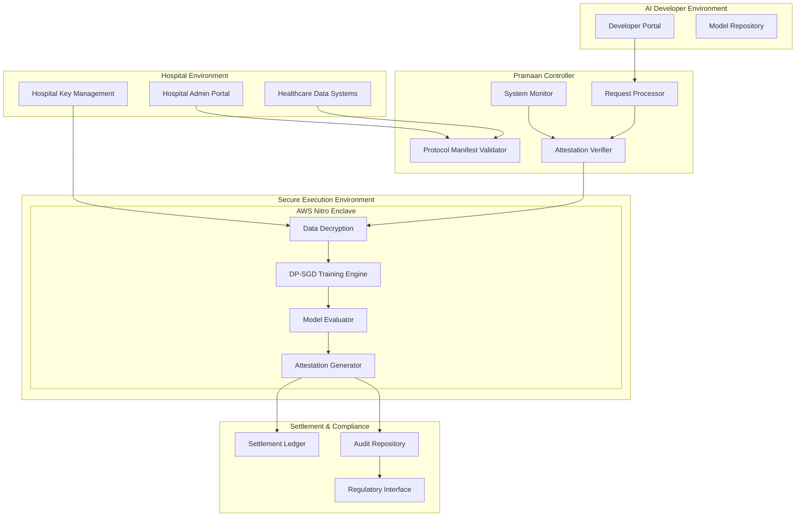

# Design Document: Pramaan-Health

## Overview

Pramaan-Health implements a confidential AI training protocol that enables hospitals to contribute sensitive healthcare data for AI model training without exposing raw patient information. The system provides cryptographically verifiable trust through hardware-isolated execution, differential privacy enforcement, and comprehensive attestation mechanisms.

The architecture follows a four-layer design: Policy Layer (The Handshake), Execution Layer (The Vault), Incentive Layer (The Settlement), and Trust & Compliance Layer (The Proof). Each layer provides specific guarantees while maintaining end-to-end security and regulatory compliance.

## Architecture

The Pramaan-Health system employs a distributed architecture with secure enclaves as the core trust boundary:



## Components and Interfaces

### Policy Layer Components

**Protocol Manifest Validator**
- Validates machine-readable policy documents against schema
- Enforces purpose limitation, dataset scope, and privacy constraints
- Supports versioning and template management
- Interface: REST API for manifest CRUD operations

**Request Processor**
- Processes AI developer training requests
- Validates requests against approved Protocol Manifests
- Manages request lifecycle and status tracking
- Interface: GraphQL API for request submission and tracking

### Execution Layer Components

**Secure Enclave Manager**
- Manages AWS Nitro Enclave lifecycle
- Handles enclave attestation and integrity verification
- Controls data ingress/egress policies
- Interface: Internal service with hardware attestation APIs

**Data Decryption Service**
- Decrypts healthcare data within enclave memory only
- Implements zero-persistence data handling
- Manages hospital encryption keys securely
- Interface: Internal enclave service with key management integration

**DP-SGD Training Engine**
- Implements differentially private stochastic gradient descent
- Tracks privacy budget consumption (epsilon, delta parameters)
- Enforces training termination on budget exhaustion
- Interface: Internal training API with privacy accounting

**Model Evaluator**
- Evaluates trained models against success metrics within trusted boundary
- Computes performance improvements over baseline models
- Prevents metric manipulation by external parties
- Interface: Internal evaluation service with metric computation APIs

### Incentive Layer Components

**Credit Calculator**
- Computes Social Credits based on verified performance improvements
- Implements incentive logic from Protocol Manifests
- Validates credit allocation rules
- Interface: Internal service with settlement integration

**Settlement Ledger**
- Records credit transactions on permissioned blockchain
- Routes credits to designated public health funds
- Maintains immutable transaction history
- Interface: Blockchain RPC with smart contract integration

### Trust & Compliance Layer Components

**Attestation Generator**
- Creates cryptographically signed attestation receipts
- Includes proofs of policy enforcement and privacy compliance
- Generates merkle proofs of execution integrity
- Interface: Internal service with hardware signing keys

**Audit Repository**
- Stores compliance artifacts and audit trails
- Provides tamper-evident logging capabilities
- Supports regulatory reporting requirements
- Interface: REST API for audit data retrieval

**Regulatory Interface**
- Provides standardized compliance reporting
- Enables third-party attestation verification
- Supports DPDP Act reporting requirements
- Interface: REST API with regulatory data formats

## Data Models

### Protocol Manifest Schema

```json
{
  "manifestId": "string (UUID)",
  "version": "string (semver)",
  "hospital": {
    "id": "string",
    "name": "string",
    "publicKey": "string (PEM)"
  },
  "purposeLimitation": {
    "allowedPurposes": ["string"],
    "prohibitedUses": ["string"],
    "dataRetentionPeriod": "duration"
  },
  "datasetScope": {
    "dataTypes": ["string"],
    "patientCriteria": "object",
    "temporalRange": {
      "startDate": "date",
      "endDate": "date"
    },
    "sampleSize": "integer"
  },
  "privacyGuardrails": {
    "epsilonBudget": "number",
    "deltaBudget": "number",
    "minimumGroupSize": "integer",
    "suppressionThreshold": "integer"
  },
  "successMetrics": {
    "primaryMetric": "string",
    "threshold": "number",
    "evaluationMethod": "string"
  },
  "incentiveLogic": {
    "baseCredits": "integer",
    "performanceMultiplier": "number",
    "fundDestination": "string"
  },
  "signature": "string (cryptographic signature)"
}
```

### Training Request Schema

```json
{
  "requestId": "string (UUID)",
  "manifestId": "string (UUID)",
  "aiDeveloper": {
    "id": "string",
    "name": "string",
    "publicKey": "string (PEM)"
  },
  "modelSpecification": {
    "architecture": "string",
    "hyperparameters": "object",
    "trainingConfig": "object"
  },
  "computeRequirements": {
    "instanceType": "string",
    "maxTrainingTime": "duration",
    "memoryRequirements": "string"
  },
  "status": "enum (pending, approved, rejected, executing, completed)",
  "submissionTimestamp": "timestamp",
  "signature": "string (cryptographic signature)"
}
```

### Attestation Receipt Schema

```json
{
  "receiptId": "string (UUID)",
  "requestId": "string (UUID)",
  "manifestId": "string (UUID)",
  "executionSummary": {
    "startTime": "timestamp",
    "endTime": "timestamp",
    "enclaveId": "string",
    "enclaveAttestation": "string (base64)"
  },
  "policyEnforcement": {
    "purposeCompliance": "boolean",
    "datasetCompliance": "boolean",
    "privacyCompliance": "boolean"
  },
  "privacyAccounting": {
    "epsilonUsed": "number",
    "deltaUsed": "number",
    "privacyProof": "string (cryptographic proof)"
  },
  "dataDestruction": {
    "destructionTimestamp": "timestamp",
    "destructionProof": "string (cryptographic proof)"
  },
  "performanceResults": {
    "metricValue": "number",
    "improvementScore": "number",
    "creditsAwarded": "integer"
  },
  "cryptographicProofs": {
    "executionIntegrity": "string (merkle proof)",
    "outputConstraints": "string (proof)",
    "chainOfCustody": "string (proof)"
  },
  "signature": "string (hardware-backed signature)",
  "timestamp": "timestamp"
}
```

## Correctness Properties

*A property is a characteristic or behavior that should hold true across all valid executions of a system—essentially, a formal statement about what the system should do. Properties serve as the bridge between human-readable specifications and machine-verifiable correctness guarantees.*

Based on the prework analysis, I've identified the following testable properties while eliminating redundancy:

**Property 1: Protocol Manifest Validation**
*For any* Protocol Manifest, the system should validate it against the complete schema and ensure all required fields (purpose limitation, dataset scope, privacy guardrails, success metrics, incentive logic) are present and valid
**Validates: Requirements 1.1, 1.2, 7.2**

**Property 2: Request-Manifest Compliance**
*For any* training request and Protocol Manifest pair, the system should correctly validate the request against manifest constraints and reject requests that violate policy parameters
**Validates: Requirements 1.3, 1.4**

**Property 3: Policy Violation Response**
*For any* detected policy violation during execution, the system should terminate execution and generate violation attestations
**Validates: Requirements 1.5**

**Property 4: Network Isolation During Training**
*For any* training execution within the secure enclave, all network egress attempts should be denied by default
**Validates: Requirements 2.2**

**Property 5: Data Destruction After Training**
*For any* completed training session, all decrypted healthcare data should be destroyed from memory and not persist to storage
**Validates: Requirements 2.3, 2.4**

**Property 6: Integrity Compromise Response**
*For any* enclave integrity compromise event, the system should halt execution and generate security alerts
**Validates: Requirements 2.5**

**Property 7: Differential Privacy Application**
*For any* training execution, differential privacy should be applied during gradient computation using DP-SGD with proper noise addition
**Validates: Requirements 3.1**

**Property 8: Privacy Budget Management**
*For any* training session, the privacy budget should be initialized from manifest specifications, tracked throughout training, and cause training termination when exhausted, with cryptographic proof of usage generated
**Validates: Requirements 3.2, 3.3, 3.4, 3.5**

**Property 9: Model Output Privacy Protection**
*For any* trained model, output perturbation should be applied to parameters and differential privacy guarantees should be validated before release
**Validates: Requirements 4.1, 4.2**

**Property 10: Model Internal Protection**
*For any* trained model, internal components that could leak training data should be prevented from external extraction
**Validates: Requirements 4.4**

**Property 11: Output Constraint Attestation**
*For any* model output, attestations proving output constraint compliance should be generated
**Validates: Requirements 4.5**

**Property 12: Performance Evaluation and Credit Calculation**
*For any* completed training, performance should be evaluated against Protocol Manifest success metrics and Social Credits should be computed based on verified improvements
**Validates: Requirements 5.1, 5.2**

**Property 13: Credit Settlement**
*For any* performance that meets threshold criteria, credit allocation should be recorded on the Settlement Ledger and routed to designated public health funds
**Validates: Requirements 5.3, 5.4**

**Property 14: Comprehensive Attestation Generation**
*For any* system execution, time-stamped Attestation Receipts should be generated with cryptographic signatures, including proofs of differential privacy compliance, data destruction, and execution integrity using hardware-backed keys and merkle proofs
**Validates: Requirements 5.5, 6.1, 6.2, 6.3, 8.1, 8.3**

**Property 15: Audit Compliance**
*For any* audit request, the system should provide verifiable compliance artifacts and maintain immutable logs of all system interactions
**Validates: Requirements 6.4, 6.5**

**Property 16: Manifest Versioning and Notifications**
*For any* Protocol Manifest update, the system should support versioning for iterative refinement and notify affected AI Developers of changes
**Validates: Requirements 7.3, 7.5**

**Property 17: Template Functionality**
*For any* common healthcare use case, Protocol Manifest templates should be available and function correctly
**Validates: Requirements 7.4**

**Property 18: Public Key Infrastructure**
*For any* attestation verification request, the PKI should enable third-party verification without system access and maintain cryptographic chain of custody
**Validates: Requirements 8.2, 8.4, 8.5**

**Property 19: Healthcare Data Format Support**
*For any* healthcare data in standard formats (HL7 FHIR, DICOM), the system should correctly parse, validate integrity and completeness, and encrypt using hospital-controlled keys
**Validates: Requirements 9.1, 9.2, 9.3**

**Property 20: Secure API Functionality**
*For any* API request for Protocol Manifest management or healthcare system integration, the system should implement proper security controls and provide detailed error diagnostics for failures
**Validates: Requirements 7.1, 9.4, 9.5**

**Property 21: System Monitoring and Alerting**
*For any* system operation, real-time monitoring should track enclave health and performance, generate alerts for violations and incidents, and trigger automated incident response procedures
**Validates: Requirements 10.1, 10.2, 10.3**

**Property 22: Dashboard and Audit Logging**
*For any* system metric or interaction, dashboards should display accurate tracking information and audit logs should maintain tamper-evident properties for forensic analysis
**Validates: Requirements 10.4, 10.5**

## Error Handling

The Pramaan-Health system implements comprehensive error handling across all layers:

**Policy Layer Error Handling:**
- Invalid Protocol Manifests are rejected with detailed validation errors
- Malformed training requests return structured error responses
- Policy violations during execution trigger immediate termination with attestation generation

**Execution Layer Error Handling:**
- Enclave integrity failures halt all operations and generate security alerts
- Privacy budget exhaustion terminates training gracefully with partial results
- Data decryption failures prevent training initiation and log security events
- Network isolation violations are blocked and logged as security incidents

**Incentive Layer Error Handling:**
- Credit calculation failures are logged and require manual review
- Settlement ledger transaction failures trigger retry mechanisms with exponential backoff
- Performance evaluation errors prevent credit allocation and generate audit events

**Trust & Compliance Layer Error Handling:**
- Attestation generation failures prevent result release and trigger investigation
- Audit log corruption is detected through cryptographic integrity checks
- Regulatory reporting failures are escalated to compliance officers with detailed diagnostics

**Recovery Mechanisms:**
- Automatic retry for transient failures with circuit breaker patterns
- Graceful degradation for non-critical component failures
- Manual intervention workflows for critical system failures
- Comprehensive logging for forensic analysis and system debugging

## Technology Stack

### Programming Language
**Primary Language: Python**
- Well-suited for differential privacy training (DP-SGD) and ML workflows
- Excellent property-based testing support with Hypothesis library
- Rapid prototyping capabilities for research-grade systems
- Rich ecosystem for confidential computing and DP research tooling

**Secondary Languages (Future Scope):**
- TypeScript for lightweight admin or policy-authoring interfaces
- Infrastructure as Code (IaC) and CI/CD tooling (out of scope for pilot)

### AWS-Powered Architecture (Pilot Scope)

**1. Secure Execution & Compute**
- **AWS Nitro Enclaves**: Hardware-isolated secure execution environment for confidential AI training
- **Amazon EC2 (Parent Instance)**: Hosts the enclave and orchestrates execution lifecycle

**2. Identity, Keys & Trust**
- **AWS KMS**: Manages encryption keys, releases keys only after enclave attestation (PCR-based)
- **Hardware-backed Attestation**: Verifies enclave integrity before data access

**3. Data Storage (Governed Access)**
- **Amazon S3**: Encrypted storage for healthcare datasets with strict policy-controlled access
- **S3 Object Lock/Versioning** (conceptual): Supports auditability and immutability requirements

**4. Policy & Authorization**
- **Policy-as-Code (Manifest-driven)**: Protocol Manifest defines consent, scope, privacy, and incentives
- **Amazon Verified Permissions/Cedar** (conceptual): Inspiration for fine-grained authorization logic

**5. Privacy & ML**
- **Differential Privacy (DP-SGD)**: Applied during training to prevent memorization
- **Privacy Accounting (RDP-based)**: Tracks epsilon/delta consumption throughout training

**6. Evaluation & Attestation**
- **Enclave-internal Model Evaluator**: Computes AUROC/F1 against baseline models
- **Cryptographic Attestation Generator**: Produces signed Attestation Receipts

**7. Incentives & Audit**
- **Amazon Managed Blockchain (Hyperledger Fabric)**: Records Social Credit settlements on permissioned, regulator-friendly ledger
- **Immutable Audit Logs** (conceptual): Stores receipts and compliance artifacts

### Implementation Scope
This is an **architecture-first pilot** and demonstration, not a full production deployment. The focus is on:
- Correctness and enforcement logic
- Trust guarantees and verifiable compliance
- Property-based testing of core protocols
- Architectural validation of the four-layer design

Not all AWS services need to be fully deployed or wired end-to-end for the pilot implementation.

## Testing Strategy

The Pramaan-Health system employs a dual testing approach combining unit tests and property-based tests for comprehensive coverage:

**Property-Based Testing:**
- Each correctness property will be implemented as a property-based test using Hypothesis (Python)
- Minimum 100 iterations per property test to ensure statistical confidence
- Tests will generate random inputs (manifests, requests, data) to verify universal properties
- Each test will be tagged with: **Feature: pramaan-health, Property {number}: {property_text}**
- Property tests focus on universal correctness guarantees across all valid inputs

**Unit Testing:**
- Specific examples and edge cases for each component
- Integration tests for component interactions
- Error condition testing for all failure modes
- Mock testing for external dependencies (AWS Nitro, blockchain)
- Unit tests complement property tests by testing concrete scenarios

**Security Testing:**
- Penetration testing of secure enclave boundaries
- Cryptographic verification of attestation mechanisms
- Privacy leakage testing for differential privacy implementation
- Network isolation verification for enclave environment

**Compliance Testing:**
- DPDP Act compliance verification through audit trail testing
- Regulatory reporting format validation
- Third-party attestation verification testing
- Chain of custody integrity verification

**Performance Testing:**
- Training execution performance under various data sizes
- Privacy budget consumption rate analysis
- Attestation generation latency measurement
- System scalability testing for multiple concurrent training sessions

The testing strategy ensures that both functional correctness and security guarantees are thoroughly validated before deployment.